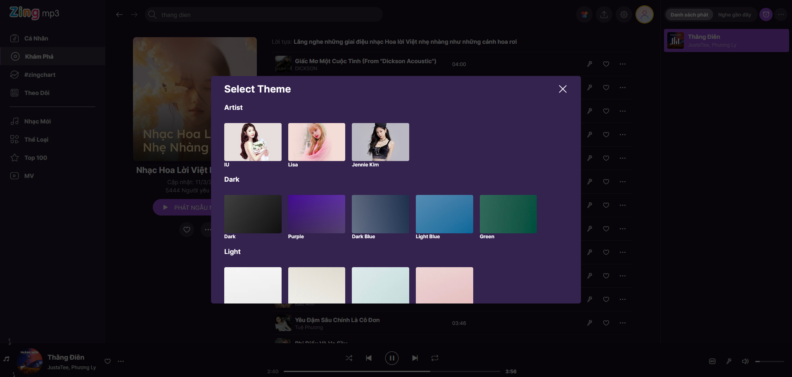

# [Demo](https://nuxt-mp3.vercel.app)
Note: This project has been migrated from [this one](https://github.com/xiaosasori/vite-zingmp3). At that time, Vue 3 had just been released, so you may find that the code still needs a lot of refactoring.

## Screenshots





## Features
- Play song like a music player...
- Shuffle list
- Karaoke
- Seek by lyric
- Change theme
- More...

## Setup

Make sure to install the dependencies:

```bash
# npm
npm install

# pnpm
pnpm install

# yarn
yarn install

# bun
bun install
```

## Development Server

Start the development server on `http://localhost:3000`:

```bash
# npm
npm run dev

# pnpm
pnpm run dev

# yarn
yarn dev

# bun
bun run dev
```

## Production

Build the application for production:

```bash
# npm
npm run build

# pnpm
pnpm run build

# yarn
yarn build

# bun
bun run build
```

Locally preview production build:

```bash
# npm
npm run preview

# pnpm
pnpm run preview

# yarn
yarn preview

# bun
bun run preview
```

Check out the [deployment documentation](https://nuxt.com/docs/getting-started/deployment) for more information.
